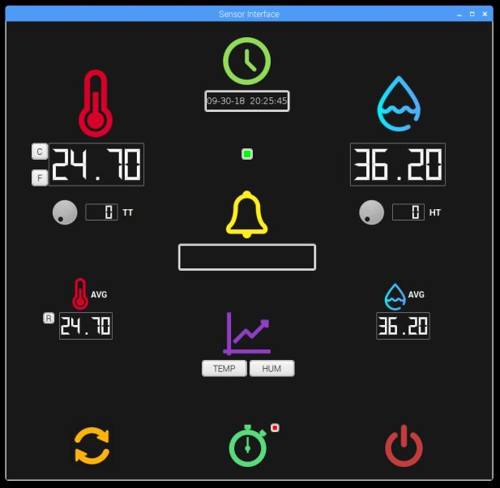

   # Project 1 : Local QT-based UI
   
   ### Created By: Preshit Harlikar
   
   
   
   #### This project demonstrates development of a rapid prototype of a stand-alone temperature monitoring device with a local user interface. The temperature and humidity sensor used is DHT22 which is interfaced with Raspberry Pi. A User Interface is created for the temperature and humidity sensor using PyQT.
   
